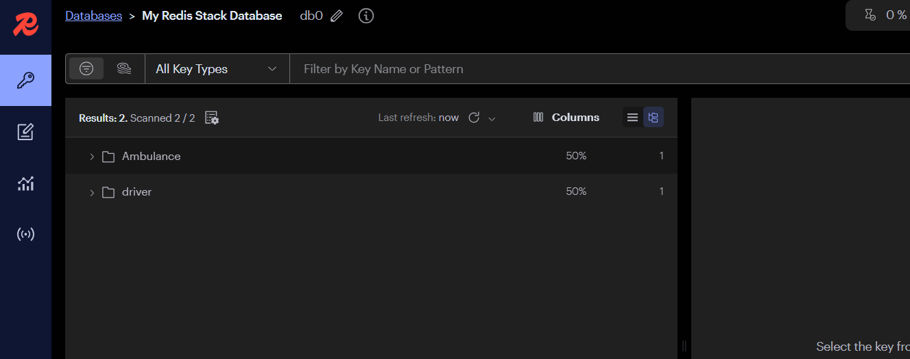

# Rider & Driver System with Redis Integration

This project includes a Rider service, Driver service, Location service (all in Node.js), and a Python-based Hospital and Medicine Recommendation System. It uses Redis and Redis Stack for data handling.

---

## Prerequisites

- Docker
- Node.js and npm
- Python 3.x
- Virtual environment for Python (venv)

---

## Installation & Setup

### 1. Install Docker

Make sure Docker is installed and running on your system. You can download Docker from [https://www.docker.com/](https://www.docker.com/).

### 2. Start Redis and Redis Stack

Run the following Docker command to pull and start Redis Stack:

```bash
docker run -d --name redis-stack -p 6379:6379 -p 8001:8001 redis/redis-stack:latest
```

After running the above command, open Docker Desktop and click Run under the redis-stack container if it is not already running.

Running the Services

Rider Service

```bash
npm install
cd Rider
node index.js
```

Runs at: http://localhost:8033/rider/

Driver Service


```bash
npm install
cd Driver
node index.js
```
Runs at: http://localhost:8011


Location Service

```bash
npm install
cd location service
node index.js
```

Hospital & Medicine Recommendation System
ctivate your Python virtual environment and run the service:

```bash
./env/Scripts/activate  # Windows
# OR
source env/bin/activate  # macOS/Linux

python main.py
```
Notes
Ensure Redis and Redis Stack are running before starting any services.

# 🚑 Emergency Service Recommendation System

This web application helps users book nearby ambulances and find the best hospitals based on specialty and distance. It uses Redis for fast data access and includes distance calculations, user authentication, and live map tracking.

---

## 🔧 Features

- 🚑 Ambulance Booking by Pincode
- 🏥 Hospital Search by Specialty
- 📍 Distance Calculation Between Rider and Hospital/Ambulance
- 🗺️ Live Ambulance Tracking on Map (via Mapbox or Leaflet)
- 📦 Redis Integration for Real-time Key Management
- 🔒 User Authentication System (Driver & Rider)

---

## 📸 Screenshots

### 1. Location Input and Specialty Search


### 2. Recommended Hospitals by Specialty


### 3. Recommended Ambulance


### 5. Redis Data Store View


### 6. Booking Confirmation Message


